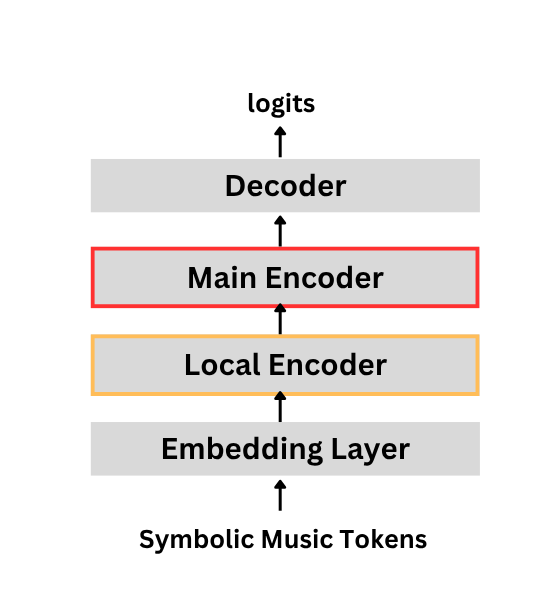
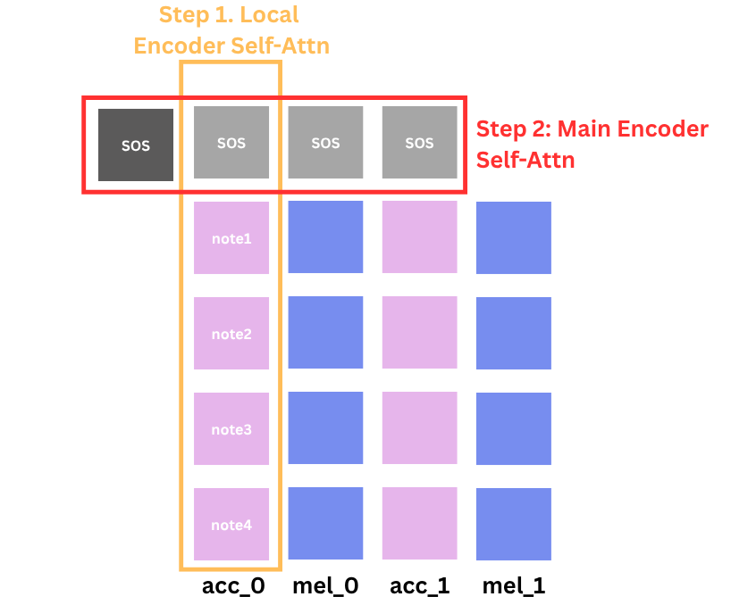
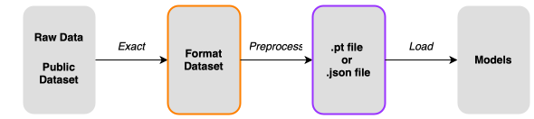

# StreamMUSE 🎹⏳
This final goal of this task is to generate accompniament given melody by user input in a real-time streaming fashion. We use 'mel' as short for melody and 'acc' as short for accompaniment. 

Below is a simple diagram showing the (1) model architecture and (2) how the encoder captures information from midi. 
<!--  -->




The model uses Roformer as its encoders and decoder. Check its documentation [here](https://huggingface.co/docs/transformers/en/model_doc/roformer). 


## Environment 

Install required packages before you start: 

    uv run

This will create a virtual environment in your directory, under folder .venv.

We adapted the transformers package for it to take care of the special positional encoding:
    
    cd transformers
    pip install -e .

## Data Preparation

The whole data preparation workflow is like the figure here:



### Get the original dataset

Download **POP909** dataset:

    git clone https://github.com/music-x-lab/POP909-Dataset.git

+ you can use Garageband or other online DAW, such as [soundtrap](https://www.soundtrap.com/musicmakers), to visualize MIDI files. 

Download **Aria** dataset, ths offical dateset is here(https://github.com/loubbrad/aria-midi), you can find the different version of the Aria dataset you want here.

### Exact the mel and acc from the original dataset

Run files under the `exact` folder to extract accompaniment and melody tracks in midi files, you should choose the **proper** one to do this exact job.

- **/exact**
    - aria_skyline.py
    - aria_ugrip_concurrent.py
    - aria_ugrip.py
    - pop909_extract.py

As the folder structure shows above, we have four different exact python files:
+ `aria_skyline.py` is the file to extract from the Aria dataset using the skyline seperation algrithom:
    ```
    python aria_skyline.py --input_dir <the path of your original aira dataset> --output_dir <the path of your output dateset(the formeted dataset)> --workers <number of worker processes to use. Defaults to the number of CPU cores> --type <type of algorithm used to extract melody and accompanement> --k <Type of algorithm used to extract melody and accompanement.>
    ```
+ `aria_ugrip_concurrent.py` is the file to extract from the Aria dataset using the seperation algrithom we proposed, and it is a concurrent script. (We have't tested it yet!!!)
+ `aria_ugrip.py` is the nonconcurrent version of the `aria_ugrip_concurrent.py`. 
+ `pop909_extract.py` is the script for POP909 dataset.

After you run the proper exact python file, you should have your MIDI dataset follow the below data structure and the same song shares same name in both folders:

- **/name_of_dataset**
    - **/mel**
        - 001.mid
        - 002.mid
        - ...
    - **/acc**
        - 001.mid
        - 002.mid
        - ...

### Make formated dataset into files our model can read
All the preprocess files is under the `preprocess` folder:

- **/preprocess**
    - preprocess_midi2pt_dataset.py
    - preprocess_midi2pt_filtered_dataset.py
    - preprocess_midi2remi2json_dataset.py

I don't show all the file in the `preprocess` folder, only those we'll use to convert our data to the tensor our model can read.

+ `preprocess_midi2pt_dataset.py` is to convert mid files of the formated dataset into pt files.
    ```
    python preprocess_midi2pt_dataset.py --folders /path/to/folder1 /path/to/folder2 --name name_of_dataset --polyphony num_of_notes
    ```
    + `--folders` let you pass folder(s) together and combine them to one tensor. 
    + `--name` just pass a name.
    + `--polyphony` let you define how many notes are allowed to play simutaneously on one timestep. 
+ `preprocess_midi2pt_filtered_dataset.py` has the same function as `preprocess_midi2pt_dataset.py`, but filters out the first 10% and last 10% of the songs to prevent the blank bar of the songs.
+ `preprocess_midi2remi2json_dataset.py` is to convert mid files to remi files first, and then convert the remi files to the json files.

The output tensor will be stored under `/data`, find it there.

## Training 

Yuo should set up all your model config in the yaml files under `schema\yaml` folder. We suggest you make a new config file when you change parameters.

After that, change the path of the yaml you congifed in the `training_runner.py`, and then run the following command:

```
uv run training_runner.py
```

<!-- Train model with:

    python m2a_transformer.py --batch_size 10 --model_size small --path_to_dataset xxx_acc.pt

+ `--model_size` can be either 'large' or 'small'.
+ `--path_to_dataset` passes tensor of the accompaniment (the model will automatically load the corresponding melody tensor at `xxx_mel.pt`).
+ `--wandb` switch logging from Tensorboard(default) to wandb, configure your wandb inside the script.
+ `--model_name` let you save the model with customized name, but make sure you include 'small' or 'large' in the model name as the indicator of its size. -->

## Inference

Download checkpoint from [here](https://huggingface.co/Jianshu001/music/blob/main/cp_transformer_909%2Bac%2B1k7_trackemb_interleavepos_v0.2_large_batch_40_schedule.epoch%3D00.val_loss%3D0.90296.ckpt) and place it under `/ckpt`
(for faster download, use wget command)

For inference, place all the melody and accompaniment midi under the `/input` folder:

- **input**
    - **/mel**
        - 001.mid
        - ...
    - **/acc**
        - 001.mid
        - ...

Run inferencen with:

    python m2a_transformer_inference.py --model_path /path/to/ckpt --prompt_len 75 --n_samples 2 --temperature 1.0

+ `--prompt_len` let you define the prompt_len.
+ `--n_samples` let you generate multiple output on one input.
+ `--temperature` let you define the temperature.

The result will be saved in `\temp.`
